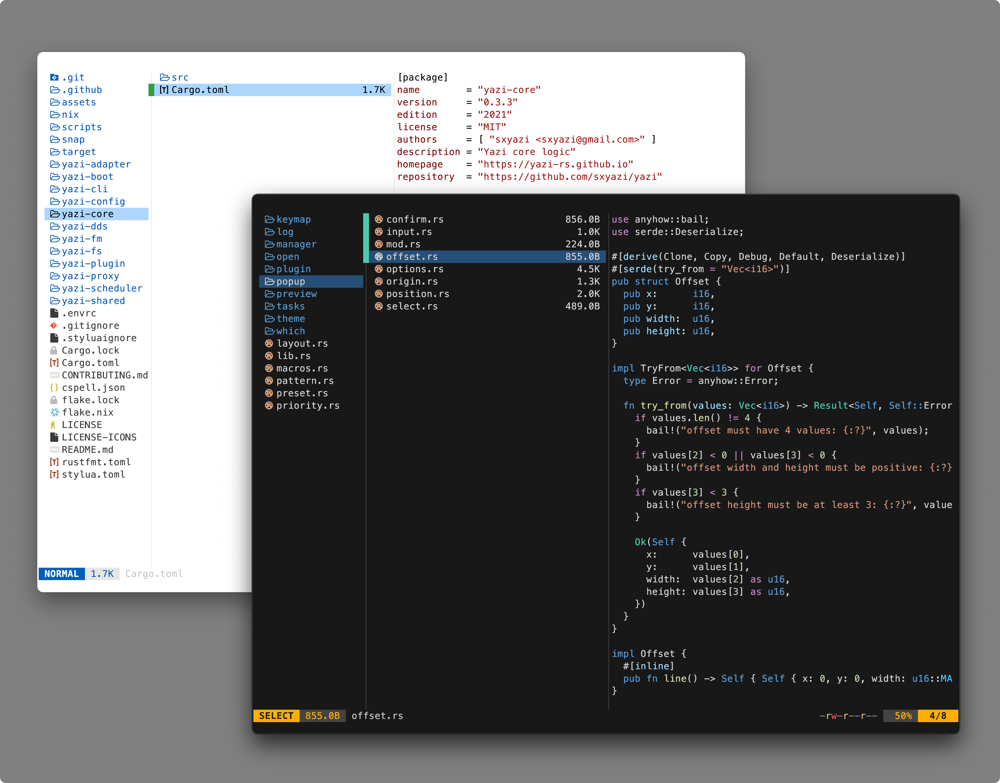

# vscode.yazi

[yazi](https://github.com/sxyazi/yazi) flavors (themes) matching the [Visual Studio Code](https://code.visualstudio.com/) default colors.



<!-- TOC -->

_Screenshots can be found in `themes/<theme>/img/*`_

- [Themes](./themes/) 
    - [vscode-dark-modern](./themes/vscode-dark-modern.yazi/)
    - [vscode-dark-plus](./themes/vscode-dark-plus.yazi/)
    - [vscode-light-modern](./themes/vscode-light-modern.yazi/)
    - [vscode-light-plus](./themes/vscode-light-plus.yazi/)

<!-- /TOC -->

## Installation

1. Clone this repository:

```bash
git clone https://github.com/956MB/vscode.yazi.git
```

2. Backup your current `theme.toml`:

```bash
cp ~/.config/yazi/theme.toml ~/.config/yazi/theme-backup.toml
```

3. Copy your desired flavor to the yazi `flavors` directory (create it if it doesn't exist):

```bash
cp -r vscode.yazi/themes/vscode-dark-modern.yazi ~/.config/yazi/flavors/
```

4. Update your Yazi configuration to use the new theme. In your `~/.config/yazi/theme.toml` file, add or modify the following lines:

```toml
[flavor]
use = "vscode-dark-modern"
```

>[!NOTE]
> Alternatively, you can copy `<theme>/flavor.toml` and `<theme>/tmtheme.xml` to your `~/.config/yazi` directory, then rename them to `theme.toml` & `<name>.tmTheme` (maybe also `.xml` too, not sure).
>
> ```toml
> # Then update the `syntect_theme` line in `theme.toml` to match:
> # (this will make sure file previews have correct syntax highlighting)
> syntect_theme = "<name>.tmTheme"
> ```

## TODO

- [ ] High contrast themes (dark/light)

## Contributing

Feel free to open an [issue](https://github.com/956MB/vscode.yazi/issues) or [PR](https://github.com/956MB/vscode.yazi/pulls) if you have any suggestions or notice any issues with the colors.

## Shoutout

- [sxyazi/yazi](https://github.com/sxyazi/yazi) Terminal file manager
- [microsoft/vscode](https://github.com/microsoft/vscode) Visual Studio Code
- [vMofiqul/vscode.nvim](https://github.com/Mofiqul/vscode.nvim) Neovim colorscheme author

## License

[MIT LICENSE](./LICENSE)
